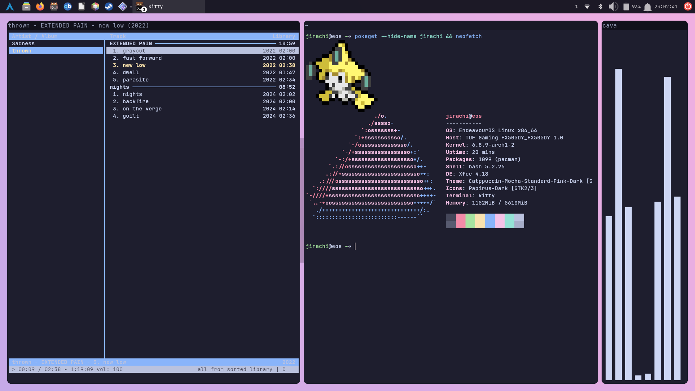
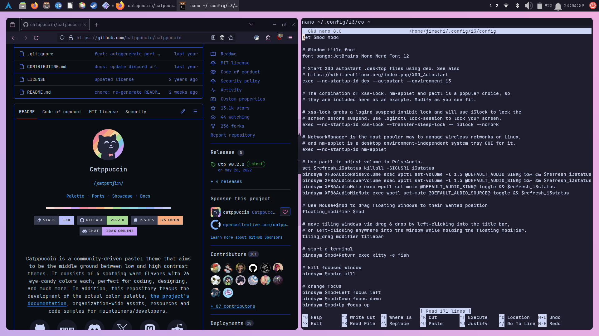
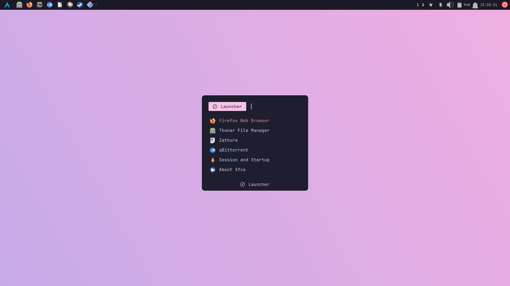
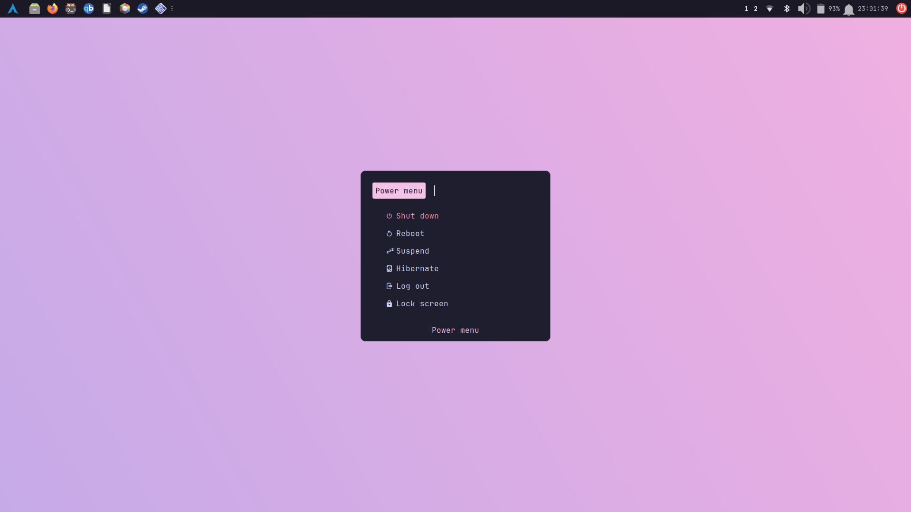

# Introduction
Hi! This repo is used to store my xfce + i3 dots. 

# Previews



 

# Installation
### Prerequisites:
- xfce (the panel and some other things)
- i3wm (the wm used)
- nitrogen (to set the wallpaper)
- rofi and rofi-power-menu (app launcher and power menu)
- picom (compositor)
- dunst (notifications)
- kitty (the terminal used)
- JetBrains Mono Nerd Font (the font used in the rice)
Optionally, you can also install cmus (the music player), cava (the audio visualiser) and pokeget (the cool little pokemon thingie in the terminal).
To install all of this, follow your distro's instructions. If you're using arch, you can download all of this with pacman and any AUR helper you like:
```
pacman -S xfce i3-wm nitrogen rofi picom dunst kitty ttf-jetbrains-mono-nerd cmus
```
and
```
yay -S rofi-power-menu pokeget cava
```
Once you've done that, go ahead and clone the repo.
```
git clone https://github.com/al4xundo/dotfiles
```
Copy the ~/.config/ stuff into your .config directory. (Be sure to back up whatever you have in your .config that might conflict with the dots!) 
Add i3wm, nitrogen and picom to your xfce startup settings, and disable xfwm4 alongside xfdesktop.
In theory, you should be all set!
# Credits
TODO
You should be all set!
